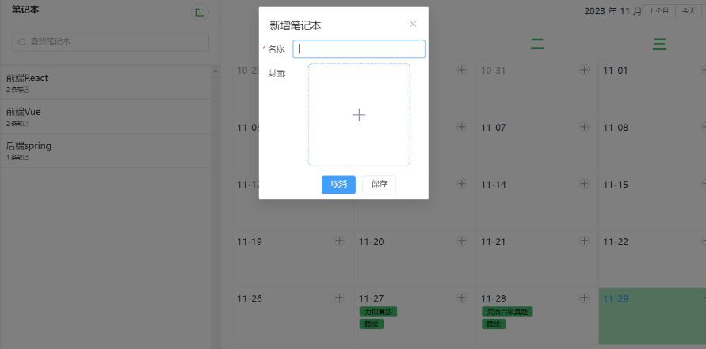

# markdown在线编辑网站
# 使用
   1.下载依赖
    `yarn `
   2.启动项目
   `yarn dev`
   __注意__:需要先启动后端项目，后续会传入gitHub中
# 技术栈：
vite + ts + vue3 + elementPlus + axios二次封装
# 功能：
   __登录注册模块__ :后端用jwt做请求拦截器返回token，以保证安全。
    
   __查看以及查询当前所有用户创建的笔记__：
    
    __创建笔记本和每日任务__
    
    __新建笔记__
   
    __其他功能尚不展示__

 